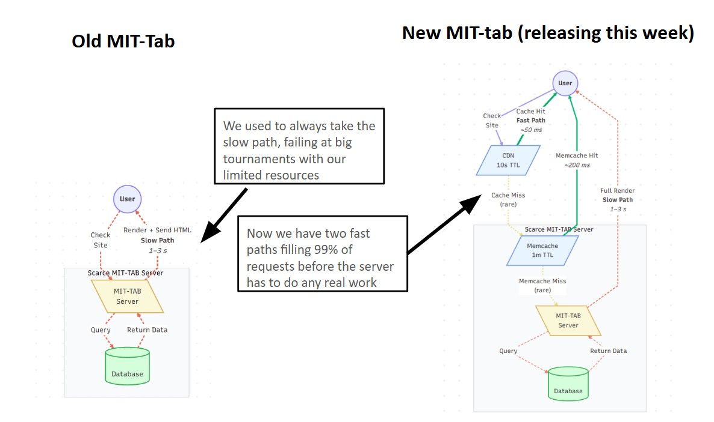
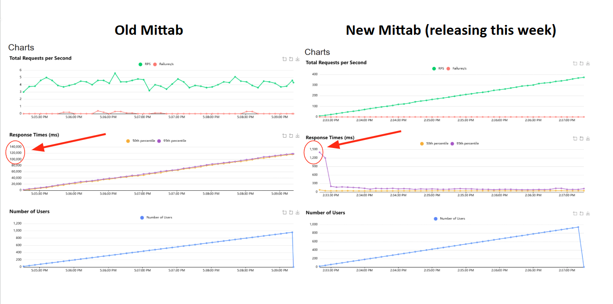

# 100x Faster: How We Supercharged MIT-Tab with a CDN

One of the most impactful improvements we've made to MIT-Tab this fall is the integration of a Content Delivery Network (CDN). This seemingly simple change has resulted in dramatic performance improvements—up to **100x faster load times** for pairings under large tournament load.

## The Problem

MIT-Tab serves hundreds of users concurrently at big tournaments. When pairings are released, a flood of new requests hits the site at the same time. MIT-Tab is made to be affordable, so it typically runs on a single shared virtual CPU core with 1 GB of RAM. With our old pairing rendering logic, every single user who hit the site would trigger it to make a new call to the database to fetch rounds, manually add those rounds to the HTML, and then respond to the user. With 1 CPU core, this was simply impossible at peak load, leading to super super long load times and occasionally users experiencing complete outages on MIT-Tab. Given the time-sensitive nature of a tournament, with everyone in person waiting to begin their round, these performance deficits have forced large tournaments to use screenshots and spreadsheets to release pairings over the last few years, adding a layer of complexity for both tournament directors and competitors.

## The Solution: CDN Integration with Smart Caching

To solve this problem, we implemented a two-layer solution combining a **Content Delivery Network (CDN)** with a dedicated **caching strategy**.

### What is a CDN and Why Does It Matter?

Think of a Content Delivery Network as a bullet-fast server network with lots of locations all across the world. It's designed to save assets directly and serve them to users at extremely fast speeds with no additional computation. Compare this to our server, which has limited bandwidth and has to re-compute what the pairings page looks like each time a user requests it. CDNs save one copy of an asset and serve it to nearby users in a fraction of a second.

In our case, when pairings are released, instead of every single user making their own request to our one small server, the CDN steps in as an intermediary. The first user to request the pairings triggers our server to generate them, but then the CDN stores that result and serves it to everyone else who asks for it without bothering our server at all. This means our tiny 1 CPU server only has to do the hard work of generating the pairings once, and the CDN handles distributing it to hundreds of users simultaneously.

### The Two-Layer Caching Strategy

The drawback of a CDN is that it's much harder to prevent serving users an old or outdated copy of tournament pairings. CDNs don't check the database to see if pairings have changed, and the cloud provider MIT-Tab uses doesn't provide any way for us to delete old CDN records when we make changes. Since we want to minimize the amount of time where old copies of pairings are served, we chose not to just use a CDN: we use a smart two-layer caching system to balance freshness with performance:

1. **CDN Layer (10-second cache)**: When pairings are first generated, the CDN stores them for 10 seconds. During those 10 seconds, every user who requests the pairings gets the exact same pre-generated result instantly, without touching our server at all. After 10 seconds, the CDN will check if anything has changed.

2. **Application Cache Layer (1-minute cache)**: Even after the CDN's 10-second window expires, we have a second safety net. Our server itself caches the generated pairings for 1 minute. So when the CDN checks back with our server, the server can respond instantly with the cached version instead of re-computing everything from scratch. The cache is similar to the CDN in that it stores and saves responses without querying the database. The advantage is that, unlike the CDN, we can easily delete records from the cache when we know they've changed. Although a cache is much faster than regenerating a full response, because it's still hosted on our 1-core vCPU server, it's slower than the CDN.

3. **Full Recomputation**: Only after both windows have expired (more than 1 minute has passed) will the server actually go back to the database and regenerate the pairings from scratch.

This layered approach means that during peak load—when hundreds of people are frantically trying to see their pairings—our little server only has to do the expensive work of querying the database and building the HTML once per minute at most, instead of hundreds of times per second. However, we're still able to update stale data within 10 seconds of it expiring.

*(Diagram showing CDN edge cache, application cache layer, and origin/database flow)*

### How This Changes the User Experience

- **Before**: Tournament director releases pairings → 200 people hit refresh at the same moment → server tries to handle 200 simultaneous database queries and HTML generations → server is overwhelmed → some users wait 30+ seconds, others get timeout errors → chaos ensues.

- **After**: Tournament director releases pairings → first person to load the page triggers one database query → result is cached → next 199 people get instant responses from the CDN → everyone sees their pairing in under a second → tournament runs smoothly.

## Performance Results

The results speak for themselves:

When we tested this under a simulated 1,000-user load, the difference was dramatic:

Load time under peak traffic reduced from nearly a minute (with frequent timeouts) to under 0.3 seconds consistently. Even as more users checked pairings, the 50th and 95th percentile load times stayed consistent, where as they continued to progressively slow with the old set-up.

## Tradeoff
The biggest takeaway for tournament directors is to be a bit more cognizant of pairings not always releasing immediately. Releasing will take about 10 seconds, and changes may not be reflected for up to a minute, although you can always unpublish and republish pairings to update the local cache and speed that process up to 10 seconds. Because we set such a quick 10-second refresh on the cache, this likely won't end up being too consequential.

## Conclusion

The combination of CDN caching and application-level caching should be a huge improvement to the MIT-Tab experience. Best of all, this entire solution runs on the same affordable server we've always used: no expensive hardware upgrades required. 

---

*If you have questions about this implementation or suggestions for further improvements, feel free to reach out to the Tech Committee or open an issue on our [GitHub repository](https://github.com/mit-tab/mit-tab).* 

*Posted by Joey Rubas, Tech Committee Chair.*
